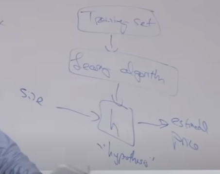

# Lecture2. Linear Regression and Gradient Descent
## Outline
- Linear regression (= ordinary least squares)
- Batch/stochastic gradient descent
- Normal equation

## Linear Regression

job of supervised learning    
</img>   
when designing a learning algorithm the first thing you need to ask is how do you represent the hypothesis H?   
Choose 
 
such that h(x) 
 
y for training example

### Ex1
```
x(front view image) --> y (steering)
: supervised linear regression cuz y is continuous
```

### Ex2

```
The job of the learning algorithm is to choose parameters theta that allows you to make good predictions about your prices of houses
in linear regression, the hypothesis is going to be h(x) = theta_0 + theta_1 * x (technically, it is affine function cuz of theta_0. w/o theta_0, it is linear function, but doesn't matter..)
if you have more than one data, h(x) = theta_0 + theta_1 * x1 + theta_2 * x2 ( x1 = size, x2 = # bedrooms)
h(x) = sum([ theta_j * x_j from j in range(0, 3) ], x_0 = 1
```

## notation
 = parameters   
m = # training examples (# rows in table)   
x = "inputs" or "features"   
y = "output" or "target variable"   
(x, y) = training example    
 = ith training example  
 = h(x)  


