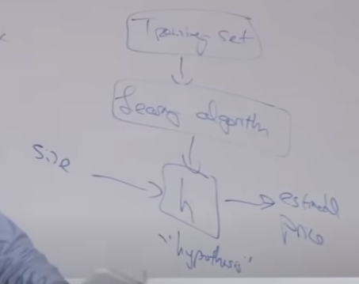
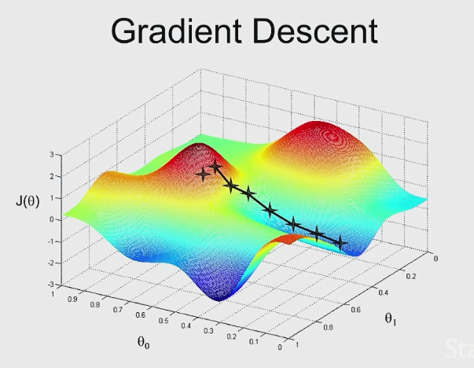

# Lecture2. Linear Regression and Gradient Descent
## Outline
- Linear regression (= ordinary least squares)
- Batch/stochastic gradient descent
- Normal equation

## notation
 = parameters   
m = # training examples (# rows in table)   
x = "inputs" or "features"   
y = "output" or "target variable"   
(x, y) = training example    
 = i th training example  
 = h(x)  
## Linear Regression

job of supervised learning    
</img>   
when designing a learning algorithm the first thing you need to ask is how do you represent the hypothesis H?   
Choose 
 
such that h(x) 
 
y for training example      
   
we wanna minimize the squared difference between the prediction and y  (choose values of theta that minimize that) 
  
to make derivative simpler,   
    

> why square error?   
It is because of the generalization of linear regression
Linear regressino is a special case of a bigger family of algorithms called generalizing your models.   
Using squared error corresponds to gaussian

## Gradient Descent
Algorithm to find the value of Theta that minimizes Cost Function J of Theta.   
   
Start with some 
 
(Say 

)   
Keep changing 

to reduce 
   

</img>   
   
> It turns outu that when you run gradient descents on linear regression, there will not be local optimum

### Implementation
The dataset(training set) is fixed
The cost function J is fixed
The only thing you're gonna do is tweak or modify the parameters 
   

   
>  is learning rate   
> a:=b means we're gonna take the value on the right and assign it to a on the left.
> a=b means I'm asserting the fact that the value of a is equal to the value of b


### Ex1
```
x(front view image) --> y (steering)
: supervised linear regression cuz y is continuous
```

### Ex2

```
The job of the learning algorithm is to choose parameters theta that allows you to make good predictions about your prices of houses
in linear regression, the hypothesis is going to be h(x) = theta_0 + theta_1 * x (technically, it is affine function cuz of theta_0. w/o theta_0, it is linear function, but doesn't matter..)
if you have more than one data, h(x) = theta_0 + theta_1 * x1 + theta_2 * x2 ( x1 = size, x2 = # bedrooms)
h(x) = sum([ theta_j * x_j from j in range(0, 3) ], x_0 = 1
```


