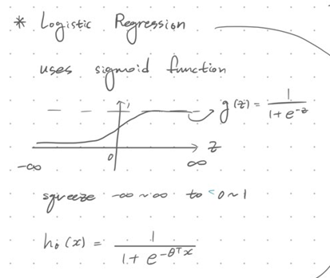
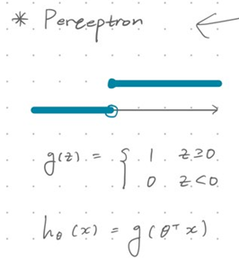
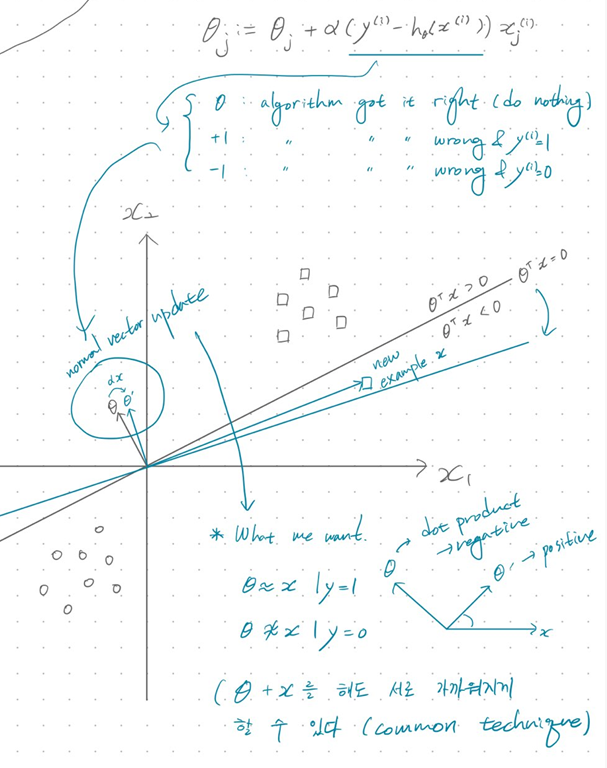

# DAVIAN Lab. Deep Learning Winter Study (2021)

- **Writer:** Min-Jung Kim

## Information

- **Title:** (cs229) Lecture 4 : Perceptron. Exponential Family. Generalized Linear Models.
- **Link:** http://cs229.stanford.edu/notes2020fall/notes2020fall/cs229-notes1.pdf   
http://cs229.stanford.edu/livenotes2020spring/cs229-livenotes-lecture4.pdf
- **Keywords:** Perceptron, Exponential Family, Generalized Linear Model, Softmax Regression (Multi-class classification)

## Perceptron
Perceptron is somewhat similar to sigmoid function but different.   
It is hard version of sigmoid function.   

- **Logistic Regression with Sigmoid function**   
</img>    
   
- **Perceptron**   
</img>    
   
- **Geometrical Interpretation of Perceptron theta update.**   
</img>    

> Perceptron is not something that's widely used in practice.   
> We study it mostly for historical reasons.   
> It is not used because it does not have a probabilistic interpretation of what 's happening.      
> Also it could never classify xor   

## Exponential Family
